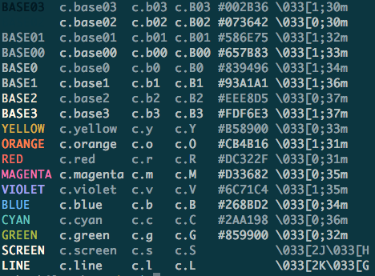
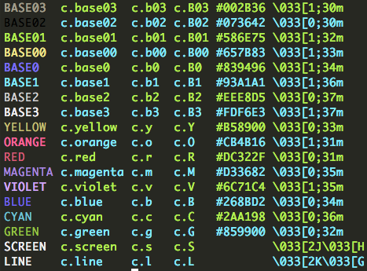
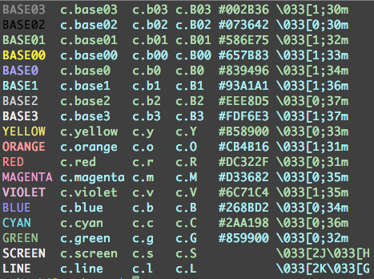
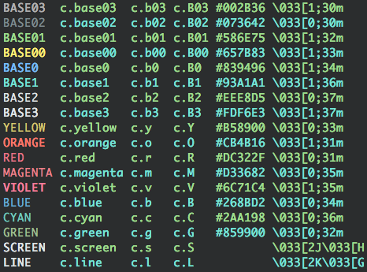

# Solarized



To see them `solarized` or `colors` commands are included.

## Fastest Possible Terminal Colors, Period

Zero dependencies. Zero function calls. Only the fastest possible
color solution using easy to use and remember aliases for escape
sequence strings. It is physically impossible to create anything
faster. (Maybe this is why the original ANSI Terminal developers
used them in the first place. Maybe it is time to stop bikeshedding
this and get something done.)

## Easier to Include in Strings

Most other approaches require the string to be passed as an argument
to a color function. Besides being remarkably slow to execute in
comparison this is not as convenient as thinking of the colors as
they actually are, markup-like tags that can be put in-line into
strings of any length.

```js
#!/usr/bin/env node
var c = require('solarized')
console.log(c.clear + c.yellow + 'Hello ' + c.cyan + 'world!' + c.reset)
console.log(c.y + 'Hello ' + c.c + 'world!' + c.x)
```

Now that we have full [template
literal](https://developer.mozilla.org/en-US/docs/Web/JavaScript/Reference/Template_literals)
support the old function-based color solutions just break down and
become even more impractical.

```js
var story = `
Once upon a ${c.y}time${c.x} there was a boy who wanted
to ${c.b3}solarize${c.x} all the things.
`
```

## Assume ANSI Support in Terminal

Seriously, it has been 30+ years. Who still does not have an ANSI
terminal? If somehow color has not been enabled that is fine. The
makers of the original ANSI escapes used escapes for that reason
since printing them to terminals that do not support color simple
ignore them already. There is no need for any extra color support
detection, at all.

## Assume Solarized Theme

All terminal color packages have to make some assumptions and none
will ever work with every possible theme. This package takes a
*convention over configuration* approach and assumes those using
it are building tools primarily for [Ethan Schoonover’s amazing
Solarized theme](http://ethanschoonover.com/solarized).

## Be Usable on Most

Solarized output *will still work* with most other terminal themes.

### Monokai



### Zenburn



### Chalk



## No Lost Orange and Violet

You may have noticed that other terminal string styling packages leave
out orange and violet. We don’t.

## Includes Screen and Line Clearing

Two of the most overlooked—and useful—ANSI escape sequences clear
the screen or just a single line. While technically these are not
colors, we include it all the same.  Simply printing them will clear
faster than anything possible on an ANSI terminal. Combining this
with other writes provides for rudimentary animation possibilities.

## 20 Lines of Node Code

That’s right, you don’t even need this module really. Just cut and
paste some variation of the following right into your own code. We
created the node module to be seen and encourage people to stop using
heavier terminal color solutions. We have also included a Mac
[solarized-dark.terminal](solarized-dark.terminal) and a few other
files that match it.

```js
m = module.exports

m.base03 = m.b03 = m.Base03 = m.B03 = '\x1b[1;30m'
m.base02 = m.b02 = m.Base02 = m.B02 = '\x1b[0;30m'
m.base01 = m.b01 = m.Base01 = m.B01 = '\x1b[1;32m'
m.base00 = m.b00 = m.Base00 = m.B00 = '\x1b[1;33m'
m.base0 = m.b0 = m.Base0 = m.B0 = '\x1b[1;34m'
m.base1 = m.b1 = m.Base1 = m.B1 = '\x1b[1;36m'
m.base2 = m.b2 = m.Base2 = m.B2 = '\x1b[0;37m'
m.base3 = m.b3 = m.Base3 = m.B3 = '\x1b[1;37m'
m.yellow = m.y = m.Yellow = m.Y = '\x1b[0;33m'
m.orange = m.o = m.Orange = m.O = '\x1b[1;31m'
m.red = m.r = m.Red = m.R = '\x1b[0;31m'
m.magenta = m.m = m.Magenta = m.M = '\x1b[0;35m'
m.violet = m.v = m.Violet = m.V = '\x1b[1;35m'
m.blue = m.b = m.Blue = m.B = '\x1b[0;34m'
m.cyan = m.c = m.Cyan = m.C = '\x1b[0;36m'
m.green = m.g = m.Green = m.G = '\x1b[0;32m'
m.reset = m.x = m.Reset = m.X = '\x1b[0m'
m.screen = m.clear = m.Screen = m.Clear = m.s = m.S  = '\x1b[2J\x1b[H'
m.line = m.l = m.Line = m.L = '\x1b[2K\x1b[G'

// nice when picking a random color
m.colors = [ m.yellow, m.orange, m.red, m.magenta, m.violet, m.blue,
m.cyan, m.green ]
```

## Go

This repo also has the Go equivalents so it can be used as follows or
just cut and paste into your own code.

```go
package main

import (
    c "github.com/skilstak/solarized"
    "fmt"
)

func main() {
    fmt.Println(c.Screen + c.R + "Hello " + c.Y + "world!")
}
```

Here’s the whole Go code:

```go
package solarized

const (
	Base03    = "\033[1;30m"
	B03       = Base03
	Base02    = "\033[0;30m"
	B02       = Base02
	Base01    = "\033[1;32m"
	B01       = Base01
	Base00    = "\033[1;33m"
	B00       = Base00
	Base0     = "\033[1;34m"
	B0        = Base0
	Base1     = "\033[1;36m"
	B1        = Base1
	Base2     = "\033[0;37m"
	B2        = Base2
	Base3     = "\033[1;37m"
	B3        = Base3
	Yellow    = "\033[0;33m"
	Y         = Yellow
	Orange    = "\033[1;31m"
	O         = Orange
	Red       = "\033[0;31m"
	R         = Red
	Magenta   = "\033[0;35m"
	M         = Magenta
	Violet    = "\033[1;35m"
	V         = Violet
	Blue      = "\033[0;34m"
	B         = Blue
	Cyan      = "\033[0;36m"
	C         = Cyan
	Green     = "\033[0;32m"
	G         = Green
	Reset     = "\033[0m"
	X         = Reset
	Screen    = "\033[2J\033[H"
	S         = Screen
	Clear     = Screen
	Line      = "\033[2K\033[G"
	L         = Line
	Clearline = Line
)

var Colors = []string{Y, O, R, M, V, B, C, G}
```

## Python

```python
#!/usr/bin/env python3

import solarized as c
print(c.clear + c.yellow + 'Hello ' + c.cyan + 'world!' + c.reset)
print(c.y + 'Hello ' + c.Line + 'world!')
```

Or cut and paste the source:

```python
base03 = b03 = Base03 = B03 = '\x1b[1;30m'
base03 = b03 = Base03 = B03 = '\x1b[1;30m'
base02 = b02 = Base02 = B02 = '\x1b[0;30m'
base01 = b01 = Base01 = B01 = '\x1b[1;32m'
base00 = b00 = Base00 = B00 = '\x1b[1;33m'
base0 = b0 = Base0 = B0 = '\x1b[1;34m'
base1 = b1 = Base1 = B1 = '\x1b[1;36m'
base2 = b2 = Base2 = B2 = '\x1b[0;37m'
base3 = b3 = Base3 = B3 = '\x1b[1;37m'
yellow = y = Yellow = Y = '\x1b[0;33m'
orange = o = Orange = O = '\x1b[1;31m'
red = r = Red = R = '\x1b[0;31m'
magenta = m = Magenta = M = '\x1b[0;35m'
violet = v = Violet = V = '\x1b[1;35m'
blue = b = Blue = B = '\x1b[0;34m'
cyan = c = Cyan = C = '\x1b[0;36m'
green = g = Green = G = '\x1b[0;32m'
reset = x = Reset = X = '\x1b[0m'
screen = clear = Screen = Clear = s = S  = '\x1b[2J\x1b[H'
line = l = Line = L = '\x1b[2K\x1b[G'

colors = [ y, o, r, m, v, b, c, g ]

```
